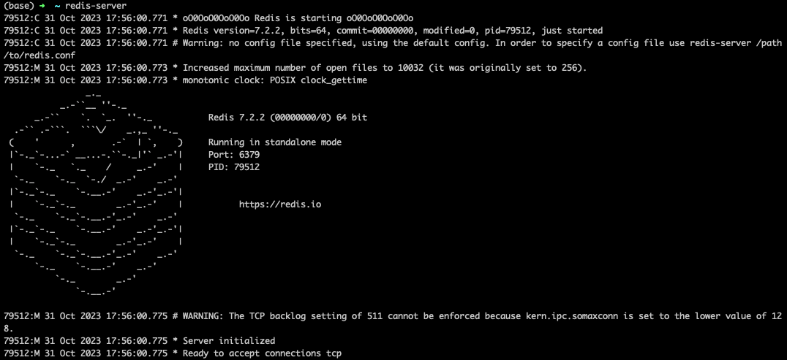
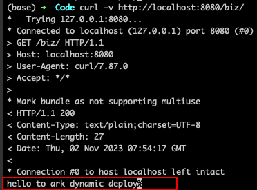
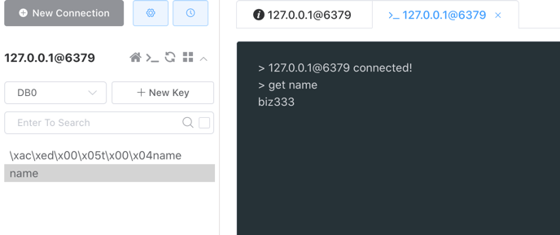

# 实验内容： 基座、模块使用 Redis

## 实验应用

### sample-redis-base
base 为普通 springboot 改造成的基座，改造内容为在 pom 里增加如下依赖
```xml

<!-- 这里添加动态模块相关依赖 -->
<!--    务必将次依赖放在构建 pom 的第一个依赖引入, 并且设置 type= pom, 
    原理请参考这里 https://sofaserverless.gitee.io/docs/contribution-guidelines/runtime/multi-app-padater/ -->
<dependency>
    <groupId>com.alipay.sofa.serverless</groupId>
    <artifactId>sofa-serverless-base-starter</artifactId>
    <version>${sofa.serverless.runtime.version}</version>
    <type>pom</type>
</dependency>
<!-- end 动态模块相关依赖 -->

<!-- 这里添加 tomcat 单 host 模式部署多web应用的依赖 -->
<dependency>
    <groupId>com.alipay.sofa</groupId>
    <artifactId>web-ark-plugin</artifactId>
</dependency>
<!-- end 单 host 部署的依赖 -->

```

### sample-redis-biz
biz 是普通 springboot 应用，修改打包插件方式为 sofaArk biz 模块打包方式，打包为 ark biz jar 包，打包插件配置如下：
```xml
<dependency>
    <groupId>com.alipay.sofa.serverless</groupId>
    <artifactId>sofa-serverless-app-starter</artifactId>
    <scope>provided</scope>
</dependency>

<!-- 修改打包插件为 sofa-ark biz 打包插件，打包成 ark biz jar -->
<plugin>
    <groupId>com.alipay.sofa</groupId>
    <artifactId>sofa-ark-maven-plugin</artifactId>
    <version>${sofa.ark.version}</version>
    <executions>
        <execution>
            <id>default-cli</id>
            <goals>
                <goal>repackage</goal>
            </goals>
        </execution>
    </executions>
    <configuration>
        <skipArkExecutable>true</skipArkExecutable>
        <outputDirectory>./target</outputDirectory>
        <bizName>${bizName}</bizName>
        <!-- 单host下需更换 web context path -->
        <webContextPath>${bizName}</webContextPath>
        <declaredMode>true</declaredMode>
    </configuration>
</plugin>
```
注意这里将不同 biz 的web context path 修改成不同的值，以此才能成功在一个 tomcat host 里安装多个 web 应用。

## 实验步骤

### 本地安装 Redis 并启动

1. 官网 [下载](https://redis.io/docs/install/) 安装 
2. MacOS 可 brew 安装 (brew install redis)，安装完成后执行 redis-server 就可以启动 Redis 服务了


### 启动基座应用 sample-redis-base

检查基座应用 pom 可以看到基座应用接入了 redis，同时，不同应用根据实际应用场景会选择不同的 redis 客户端

#### redis + lettuce
```xml
<!-- redis 依赖, spring boot 2.x 默认 lettuce 客户端，所以 lettuce-core 会作为间接依赖被引入  -->
<dependency>
    <groupId>org.springframework.boot</groupId>
    <artifactId>spring-boot-starter-data-redis</artifactId>
</dependency>
<!-- 由于 spring boot 2.x 默认没启用连接池，需要单独引入 commons-pool2，否则启动会报错 commons-pool2 ClassNotFoundException -->
<dependency>
    <groupId>org.apache.commons</groupId>
    <artifactId>commons-pool2</artifactId>
</dependency>
```

#### redis + jedis
```xml
<!-- redis 依赖，并排除默认间接依赖的 lettuce -->
<dependency>
    <groupId>org.springframework.boot</groupId>
    <artifactId>spring-boot-starter-data-redis</artifactId>
    <exclusions>
        <exclusion>
            <groupId>io.lettuce</groupId>
            <artifactId>lettuce-core</artifactId>
        </exclusion>
    </exclusions>
</dependency>
<!-- 单独引入 jedis 依赖 -->
<dependency>
    <groupId>redis.clients</groupId>
    <artifactId>jedis</artifactId>
</dependency>
```

可以使用 IDEA run 启动基座应用

### 打包模块应用 sample-redis-biz 

为模块应用添加 redis 依赖，同基座应用的依赖方式，唯一的不同是需要将 redis、lettuce、jedis 依赖都设置 scope=provided，保证相关依赖类由基座统一加载

#### redis + lettuce
```xml
<!-- redis 依赖, spring boot 2.x 默认 lettuce 客户端，所以 lettuce-core 会作为间接依赖被引入  -->
<dependency>
    <groupId>org.springframework.boot</groupId>
    <artifactId>spring-boot-starter-data-redis</artifactId>
    <scope>provided</scope>
</dependency>
<!-- 由于 spring boot 2.x 默认没启用连接池，需要单独引入 commons-pool2，否则启动会报错 commons-pool2 ClassNotFoundException -->
<dependency>
    <groupId>org.apache.commons</groupId>
    <artifactId>commons-pool2</artifactId>
    <scope>provided</scope>
</dependency>
```

#### redis + jedis
```xml
<!-- redis 依赖，并排除默认间接依赖的 lettuce -->
<dependency>
    <groupId>org.springframework.boot</groupId>
    <artifactId>spring-boot-starter-data-redis</artifactId>
    <scope>provided</scope>
    <exclusions>
        <exclusion>
            <groupId>io.lettuce</groupId>
            <artifactId>lettuce-core</artifactId>
        </exclusion>
    </exclusions>
</dependency>
<!-- 单独引入 jedis 依赖 -->
<dependency>
    <groupId>redis.clients</groupId>
    <artifactId>jedis</artifactId>
    <scope>provided</scope>
</dependency>
```

该 sample 以 redis + jedis 为例，展示模块对 redis 的使用，为模块应用添加 redis + jedis 配置，在模块的 spring 配置文件 application.properties 中添加
```properties
spring.redis.host=localhost   # 实际需要换成真实连接的redis server
spring.redis.database=0       # Redis数据库索引（默认为0）
spring.redis.port=6379        # Redis服务器连接端口
spring.redis.password=        # Redis服务器连接密码（默认为空）

spring.redis.jedis.pool.enabled=true    # spring boot 2.x 默认不启用连接池，添加配置才能成功启用
spring.redis.jedis.pool.max-active=12
spring.redis.jedis.pool.max-idle=12
spring.redis.jedis.pool.min-idle=0
spring.redis.jedis.pool.max-wait=-1ms
```

模块使用 redis 进行数据读取和写入
```java
@RestController
public class SampleController {

    @Resource
    private RedisTemplate redisTemplate;

    @Resource
    private StringRedisTemplate stringRedisTemplate;

    @RequestMapping(value = "/", method = RequestMethod.GET)
    public String hello() {

        Assert.notNull(redisTemplate);
        Assert.notNull(stringRedisTemplate);

        // 添加
        redisTemplate.opsForValue().set("name","biz");
        // 查询
        System.out.println(redisTemplate.opsForValue().get("name"));
        // 删除
        redisTemplate.delete("name");
        // 更新
        redisTemplate.opsForValue().set("name","biz111");
        // 查询
        System.out.println(redisTemplate.opsForValue().get("name"));

        // 添加
        stringRedisTemplate.opsForValue().set("name","biz222");
        // 查询
        System.out.println(stringRedisTemplate.opsForValue().get("name"));
        // 删除
        stringRedisTemplate.delete("name");
        // 更新
        stringRedisTemplate.opsForValue().set("name","biz333");
        // 查询
        System.out.println(stringRedisTemplate.opsForValue().get("name"));

        return "hello to ark dynamic deploy";
    }
}
```

完成代码改造后，在 samples/springboot-samples/redis/sample-redis-biz 目录下执行 mvn clean package -Dmaven.test.skip=true 进行模块打包， 打包完成后可在 samples/springboot-samples/redis/sample-redis-biz/redis-biz-bootstrap 的 target 目录里查看到打包生成的 ark-biz jar 包

### 安装模块应用 sample-redis-biz

#### 执行 curl 命令安装 biz1

```shell
curl --location --request POST 'localhost:1238/installBiz' \
--header 'Content-Type: application/json' \
--data '{
    "bizName": "biz",
    "bizVersion": "0.0.1-SNAPSHOT",
    // local path should start with file://, alse support remote url which can be downloaded
    "bizUrl": "file:///Users/xxxx/xxxx/Code/sofa-serverless/samples/springboot-samples/redis/sample-redis-biz/redis-biz-bootstrap/target/redis-biz-bootstrap-0.0.1-SNAPSHOT-ark-biz.jar"
}'
```

### 发起请求验证
模块中发布了 web 服务，可通过访问 web 服务，触发 redis 操作。

模块 web 服务访问成功



查看 console 控制台输出说明 redis 返回符合预期


检查 redis 数据库可以发现，数据也成功写入



## 注意事项
这里主要使用简单应用做验证，如果复杂应用，需要注意模块做好瘦身，基座有的依赖，模块尽可能设置成 provided，尽可能使用基座的依赖。

