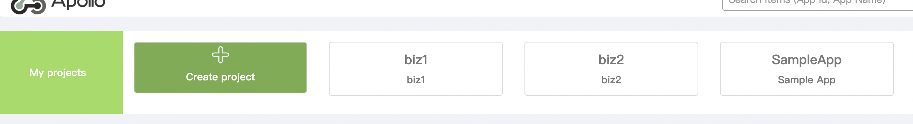
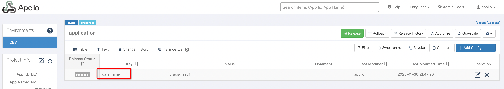

<div align="center">

English | [简体中文](./README-zh_CN.md)

</div>

# Experiment
1. using different app id for different modules, independent configuration
2. using same app id for different modules, independent configuration

## Experiment tasks
### using different app id for different modules, independent configuration
#### base 
1. add the following configuration in application.properties to solve the conflict of jmx registration bean
```properties
spring.jmx.default-domain=${spring.application.name}
```
2. add apollo configuration
```java
// using Eureka to get service address by default, but in docker bridge network mode, the service address is virtual subnet address
// so we need to use `apollo.configService` to specify the apollo service address as localhost

System.setProperty("apollo.configService", "http://localhost:8080");
System.setProperty("apollo.config-service", "http://localhost:8080");
System.setProperty("env", "DEV");
```
3. add apollo dependency in pom

4. add override class `com.ctrip.framework.apollo.spring.boot.ApolloApplicationContextInitializer` to override apollo original logic, the difference between the original class and the override class is as follows


5. add apollo config in `/META-INF/app.properties` for both base and module
Cause the initializeSystemProperty method is commented out, it is not possible to configure apollo through application.properties to initialize `app.id`. So the module needs to use `/META-INF/app.properties` for configuration.


#### Experiment steps
1. cd into config directory, execute the following command to start apollo server
```shell
docker-compose up
```
2. login apollo management background `localhost:8080`, create project with app id `biz1` and key=data.name, create project with app id `biz2` and key=data.name, see details https://www.apolloconfig.com/#/zh/deployment/quick-start





3. run `mvn clean package -DskipTests`, then start base
4. cd info apollo, run `arkctl deploy biz1/target/biz1-apollo-0.0.1-SNAPSHOT-ark-biz.jar`, install biz1 module
5. cd info apollo, run `arkctl deploy biz2/target/biz2-apollo-0.0.1-SNAPSHOT-ark-biz.jar`, install biz2 module
6. run `curl http://localhost:8081/biz1/getValue` to get biz1 config value, modify biz1 data.name, and run `curl http://localhost:8081/biz1/getValue` again to get new biz1 config value
7. run `curl http://localhost:8081/biz2/getValue` to get biz2 config value, modify biz2 data.name, and run `curl http://localhost:8081/biz2/getValue` again to get new biz2 config value

### using same app id for different modules, independent configuration
using [automatic slimming](https://koupleless.gitee.io/docs/tutorials/module-development/module-slimming/#%E4%B8%80%E9%94%AE%E8%87%AA%E5%8A%A8%E7%98%A6%E8%BA%AB) to delegate apollo client to base, add `excludeGroupIds=com.ctrip.framework.apollo*` in rules.txt to make sure apollo client is delegated to base.

Please notice that add `spring.jmx.default-domain=${spring.application.name}` in application.properties
