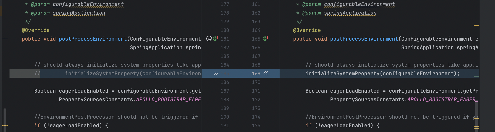
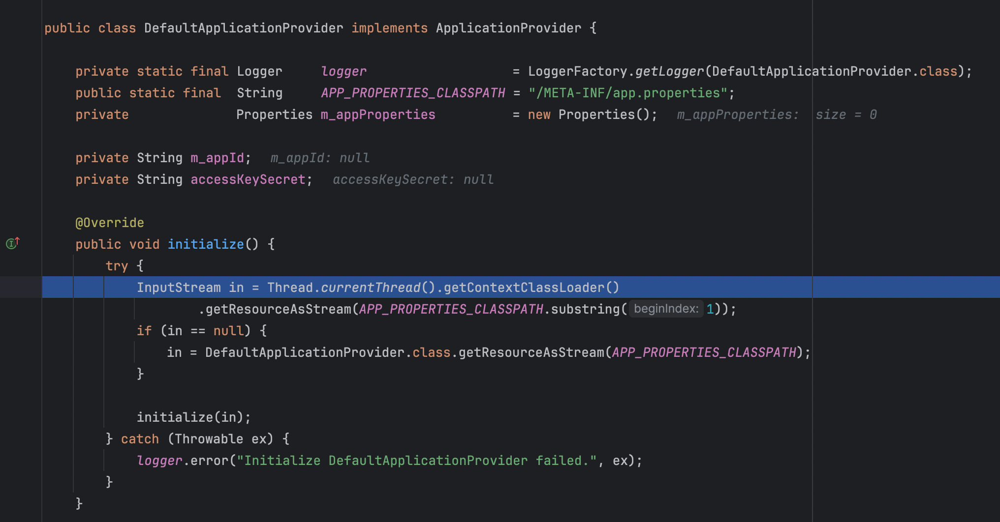

# 实验内容


1. 不同模块使用不同的 app id, 独立配置
2. 不同模块使用相同 app id，独立配置默认就已经支持

## 实验任务
### 不同模块使用不同的 app id, 独立配置
#### base 代码改造
1. application.properties 里增加如下配置，用来解决 jmx 注册 bean 冲突问题
```properties
spring.jmx.default-domain=${spring.application.name}
```
2. 配置 apollo 服务端地址
```java
// 默认 apollo 使用 Eureka 获取服务地址，由于本地 docker 采用 bridge 网络模式，通过 Eureka 获取到的是虚拟子网服务地址
// 在本地无法直接调用，所以这里直接通过自定义配置 `apollo.configService` 指定为 localhost

System.setProperty("apollo.configService", "http://localhost:8080");
System.setProperty("apollo.config-service", "http://localhost:8080");
System.setProperty("env", "DEV");
```
3. pom 里引入 apollo 依赖

4. 模块代码里添加 apollo 多应用治理类 `com.ctrip.framework.apollo.spring.boot.ApolloApplicationContextInitializer`， 注意基座里不要引入
引入覆盖 apollo 原有逻辑的治理类，与原生的类实现的区别在于如下一行

5. 模块里添加 apollo 配置文件 `/META-INF/app.properties`
由于注释了 initializeSystemProperty 方法，导致无法通过 application.properties 对 apollo 进行配置， 初始化 `app.id`。所以模块里需要使用 `/META-INF/app.properties` 进行配置。


#### 实验步骤
1. cd 进入 config 目录，执行如下命令启动 apollo 服务端
```shell
docker-compose up
```
2. 登录 apollo 管理后台，创建 app id 为 `biz` 的项目和 key=data.name 的配置，创建 app id 为 `biz2` 的项目和 key=data.name 的配置，具体查看 https://www.apolloconfig.com/#/zh/deployment/quick-start
3. 执行 `mvn clean package -DskipTests`，然后启动基座
4. 进入 apollo 目录，执行 `arkctl deploy biz1/target/biz1-apollo-0.0.1-SNAPSHOT-ark-biz.jar`, 安装 biz1 模块
5. 进入 apollo 目录，执行 `arkctl deploy biz2/target/biz2-apollo-0.0.1-SNAPSHOT-ark-biz.jar`, 安装 biz2 模块
6. 执行 `curl http://localhost:8081/biz1/getValue` 获取到 biz1 的配置值，修改 biz1 的 data.name，再次执行 `curl http://localhost:8081/biz1/getValue` 能获取到新的 biz1 的配置值
7. 执行 `curl http://localhost:8081/biz1/getValue` 获取到 biz2 的配置值，修改 biz2 的 data.name，再次执行 `curl http://localhost:8081/biz2/getValue` 能获取到新的 biz2 的配置值，也不会影响 biz1 或基座的配置值


### 不同模块使用相同 app id，独立配置默认就已经支持
模块统一使用[自动排包能力](https://sofaserverless.gitee.io/docs/tutorials/module-development/module-slimming/#%E4%B8%80%E9%94%AE%E8%87%AA%E5%8A%A8%E7%98%A6%E8%BA%AB)，在 rules.txt 文件里确保有这个配置 `excludeGroupIds=com.ctrip.framework.apollo*`，将 apollo client 委托给基座加载即可达到效果。
注意 application.properties 里增加 `spring.jmx.default-domain=${spring.application.name}`