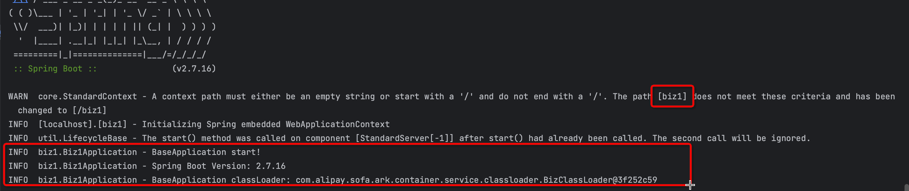

<div align="center">

English | [简体中文](./README-zh_CN.md)

</div>

# log4j2 Multiple Applications Print to Different Directorie
check principle [here](https://github.com/koupleless/koupleless/blob/master/docs/content/zh-cn/docs/contribution-guidelines/runtime/logj42.md)

# Experiment
## Experiment application
### base
The base is built from regular SpringBoot application. The only change you need to do is to add the following dependencies in pom

```xml
<!-- Add dynamic module related dependencies here -->
<!--    Be sure to put this dependency as the first dependency in the build pom, and set type= pom,
    The principle can be found here https://koupleless.gitee.io/docs/contribution-guidelines/runtime/multi-app-padater/ -->
<dependency>
    <groupId>com.alipay.sofa.koupleless</groupId>
    <artifactId>koupleless-base-starter</artifactId>
    <version>${koupleless.runtime.version}</version>
    <type>pom</type>
</dependency>
<!-- end of dynamic module related dependencies -->

<!-- Add dependencies for deploying multiple web applications in tomcat single host mode here -->
<dependency>
<groupId>com.alipay.sofa</groupId>
<artifactId>web-ark-plugin</artifactId>
</dependency>
<!-- end of dependencies for single host deployment -->

<!-- add log4j2 dependencies -->
<dependency>
    <groupId>org.springframework.boot</groupId>
    <artifactId>spring-boot-starter-log4j2</artifactId>
</dependency>

<!-- add log4j2 async queue dependencies -->
<dependency>
    <groupId>com.lmax</groupId>
    <artifactId>disruptor</artifactId>
    <version>${disruptor.version}</version>
</dependency>
<!-- end of log4j2 -->

```

### biz
The biz contains two modules, biz1 and biz2, both are regular SpringBoot. The packaging plugin method is modified to the sofaArk biz module packaging method, packaged as an ark biz jar package, and the packaging plugin configuration is as follows:

```xml
<!-- change the packaging plugin to sofa-ark biz packaging plugin, packaged as ark biz jar -->
<plugin>
    <groupId>com.alipay.sofa</groupId>
    <artifactId>sofa-ark-maven-plugin</artifactId>
    <version>${sofa.ark.version}</version>
    <executions>
        <execution>
            <id>default-cli</id>
            <goals>
                <goal>repackage</goal>
            </goals>
        </execution>
    </executions>
    <configuration>
        <skipArkExecutable>true</skipArkExecutable>
        <outputDirectory>./target</outputDirectory>
        <bizName>${bizName}</bizName>
        <!-- single host mode, need to change web context path -->
        <webContextPath>${bizName}</webContextPath>
        <declaredMode>true</declaredMode>
    </configuration>
</plugin>
```
Note that the web context path of different biz is changed to different values, so that multiple web applications can be successfully installed in a tomcat host.

## Experiment Task
### run `mvn clean package -DskipTests`
we can check the ark-biz jar package in target directory of each bundle
### start base application, and make sure base start successfully
### execute curl command to install biz1 and biz2
```shell
curl --location --request POST 'localhost:1238/installBiz' \
--header 'Content-Type: application/json' \
--data '{
    "bizName": "biz1",
    "bizVersion": "0.0.1-SNAPSHOT",
    // local path should start with file://, alse support remote url which can be downloaded
    "bizUrl": "file:///path/to/springboot-samples/samples/web/tomcat/biz1/target/biz1-log4j2-0.0.1-SNAPSHOT-ark-biz.jar"
}'
```

```shell
curl --location --request POST 'localhost:1238/installBiz' \
--header 'Content-Type: application/json' \
--data '{
    "bizName": "biz2",
    "bizVersion": "0.0.1-SNAPSHOT",
    // local path should start with file://, alse support remote url which can be downloaded
    "bizUrl": "file:///path/to/springboot-samples/samples/web/tomcat/biz2/target/biz2-log4j2-0.0.1-SNAPSHOT-ark-biz.jar"
}'
```

If you want to verify hot deployment, you can uninstall and deploy multiple times

```shell
curl --location --request POST 'localhost:1238/uninstallBiz' \
--header 'Content-Type: application/json' \
--data '{
    "bizName": "biz1-log4j2",
    "bizVersion": "0.0.1-SNAPSHOT"
}'
```

### start verification request
```shell
curl http://localhost:8080/biz1/
```
return `hello to /biz1 deploy`


```shell
curl http://localhost:8080/biz2/
```
return `hello to /biz2 deploy`

### check whether the log print is split into different directories
1. check content 1, you can see the log when the module starts in the console



2. check content 2, the logs in the `./samples/logging/log4j2/logs/` printed into as following


- log of biz1 is in `./samples/logging/log4j2/logs/biz1/` directory
- log of biz2 is in `./samples/logging/log4j2/logs/biz2/` directory
- log of base is in `./samples/logging/log4j2/logs/base/` directory
- framework log of biz1, biz2, base (such as spring sofaArk arklet, etc.) are merged into the same directory file


## Precautions
Here mainly use simple applications for verification, if complex applications, need to pay attention to the module to do a good job of slimming, the base has dependencies, the module as much as possible set to provided, as much as possible to use the base dependencies.
