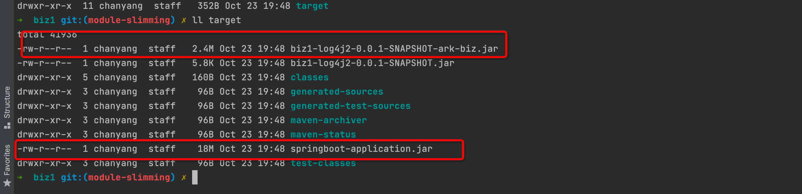
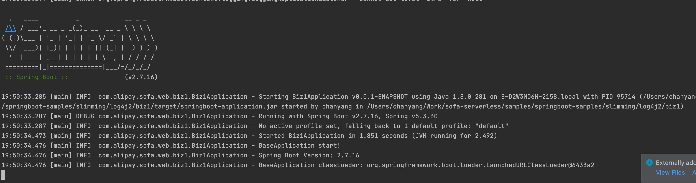

# 一键模块打包瘦身

# 实验内容
## 注意事项
打包 ark-biz jar 包的原则是，在保证模块功能的前提下，将框架、中间件等通用的包尽量放置到基座中，模块中复用基座的包，这样打出的 ark-biz jar 会更加轻量。在复杂应用中，为了更好的使用模块自动瘦身功能，需要在模块瘦身配置 (根目录/conf/ark/文件名.txt)，按照既定格式，排除更多的通用依赖包。
## 实验应用
### base
base 为普通 springboot 改造成的基座，改造内容为在主 pom 里增加如下依赖（详情可以参照其他实验）
```xml


<!-- 这里添加动态模块相关依赖 -->
<dependency>
    <groupId>com.alipay.sofa.serverless</groupId>
    <artifactId>sofa-serverless-base-starter</artifactId>
</dependency>
<!-- end 动态模块相关依赖 -->

<!-- 这里添加 tomcat 单 host 模式部署多web应用的依赖 -->
<dependency>
    <groupId>com.alipay.sofa</groupId>
    <artifactId>web-ark-plugin</artifactId>
</dependency>
<!-- end 单 host 部署的依赖 -->

<!-- log4j2 相关依赖 -->
<dependency>
    <groupId>org.springframework.boot</groupId>
    <artifactId>spring-boot-starter-log4j2</artifactId>
</dependency>

<!-- log4j2 异步队列 -->
<dependency>
    <groupId>com.lmax</groupId>
    <artifactId>disruptor</artifactId>
    <version>${disruptor.version}</version>
</dependency>
<dependency>
    <groupId>com.alipay.sofa.serverless</groupId>
    <artifactId>sofa-serverless-log4j2-starter</artifactId>
    <version>${sofa.serverless.runtime.version}</version>
</dependency>
<!-- end log4j2 依赖引入 -->

```

### biz1
biz1 包含两个打包插件，一个常规 springboot 插件, 构建普通 springboot 包; 另一个插件为 sofaArk biz 模块插件，构建 ark biz jar 包，打包插件配置如下：
```xml
<!-- 模块需要引入专门的 log4j2 adapter 做日志适配 -->
<dependency>
    <groupId>com.alipay.sofa.serverless</groupId>
    <artifactId>sofa-serverless-adapter-log4j2</artifactId>
    <version>${sofa.serverless.runtime.version}</version>
    <!--<scope>provided</scope> -->
    <!-- 不进行模块瘦身，需要修改依赖 scope 为 provided，使得模块复用基座的 jar 包 -->
    <!-- 添加模块自动瘦身后，不需要修改模块的任何代码 -->
</dependency>

 <!-- 以下插件配置是本次实验的关键内容 -->
<build>
<plugins>
    <!-- 插件1：打包插件为 sofa-ark biz 打包插件，打包成 ark biz jar -->
    <plugin>
        <groupId>com.alipay.sofa</groupId>
        <artifactId>sofa-ark-maven-plugin</artifactId>
        <version>${sofa.ark.version}</version>
        <executions>
            <execution>
                <id>default-cli</id>
                <goals>
                    <goal>repackage</goal>
                </goals>
            </execution>
        </executions>
        <configuration>
            <skipArkExecutable>true</skipArkExecutable>
            <outputDirectory>./target</outputDirectory>
            <bizName>biz1</bizName>
            <!-- packExcludesConfig	模块瘦身配置，文件名自定义，和配置对应即可-->
            <!--					配置文件位置：biz1/conf/ark/rules.txt-->
            <packExcludesConfig>rules.txt</packExcludesConfig>
            <webContextPath>biz1</webContextPath>
            <declaredMode>true</declaredMode>
            <!--					打包、安装和发布 ark biz-->
            <!--					静态合并部署需要配置-->
            <!--					<attach>true</attach>-->
        </configuration>
    </plugin>
    <!-- 插件2：打包插件为普通 springboot 打包插件，打包成普通 springboot 可执行 jar -->
    <plugin>
        <groupId>org.springframework.boot</groupId>
        <artifactId>spring-boot-maven-plugin</artifactId>
        <configuration>
            <!--					可以在配置中，排除模块的特殊依赖-->
            <finalName>springboot-application</finalName>
        </configuration>
    </plugin>
</plugins>
</build>
```

## 实验任务
### 执行 mvn clean package -DskipTests
可在各 biz1 bundle 的 target 目录里查看到打包生成的 ark-biz jar 包 和 普通 springboot 包, 明显经过模块瘦身的 ark-biz jar 包大小更小



### 启动基座应用 base，确保基座启动成功
### 执行 curl 命令安装 biz1 
```shell
curl --location --request POST 'localhost:1238/installBiz' \
--header 'Content-Type: application/json' \
--data '{
    "bizName": "biz1",
    "bizVersion": "0.0.1-SNAPSHOT",
    // local path should start with file://, alse support remote url which can be downloaded
    "bizUrl": "file:///path/to/springboot-samples/samples/web/tomcat/biz1/target/biz1-log4j2-0.0.1-SNAPSHOT-ark-biz.jar"
}'
```

### 发起请求验证
```shell
curl http://localhost:8080/biz1
```
返回 `hello to /biz1 deploy`

### 停止基座应用 base的启动
### 以普通 springboot 的方式启动biz1


### 发起请求验证
```shell
curl http://localhost:8080/
```
返回
返回 `hello to /biz1 deploy`

