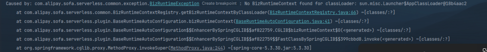

## SOFAServerless 支持中间件列表与样例

| 中间件                    | 说明           | 代码样例                                                                                                                                           |
|------------------------|--------------|------------------------------------------------------------------------------------------------------------------------------------------------|
| tomcat                 | 单host模式      | [samples/springboot3-samples/web/tomcat/](https://github.com/sofastack-guides/springboot3-samples/tree/master/samples/web/tomcat)                | 
| log4j2                 | 基座与模块独立日志目录  | [samples/springboot3-samples/logging/log4j2](https://github.com/sofastack/sofa-serverless/tree/master/samples/springboot3-samples/logging/log4j2) |
| kafka                  | 模块独立使用 kafka | [samples/springboot3-samples/msg/kafka](https://github.com/sofastack/sofa-serverless/tree/master/samples/springboot3-samples/msg/kafka/)         |
| mybatis                | 模块使用独立数据源    | [samples/springboot3-samples/db/mybatis](https://github.com/sofastack/sofa-serverless/tree/master/samples/springboot3-samples/db/mybatis)   |

### 注意请在编译器单独导入sofa-serverless/samples/springboot-samples 工程，否则会出现 BizRuntieContext Not found 的报错。

原因：samples 工程与 sofa-serverless-runtime 在一个工程目录里，会优先使用本地的 sofa-serverless-runtime，而不是 maven 依赖的 sofa-serverless-runtime，导致找不到 BizRuntimeContext 类。
